# FACE: ArcFace White-box Geometric Identity Optimization

Frozen iResNet-100 identity-distance results with downstream InstructPix2Pix evaluation

FACE optimizes `Z = 1 - cosine_similarity` with `loss = -Z` against frozen ArcFace iResNet-100.

## Image strips

### face_002 / add black sunglasses

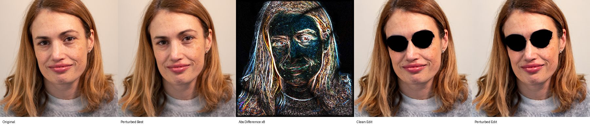

### face_002 / add headphones

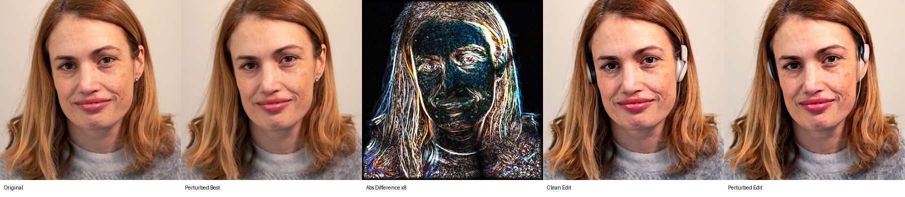

### face_005 / add black sunglasses

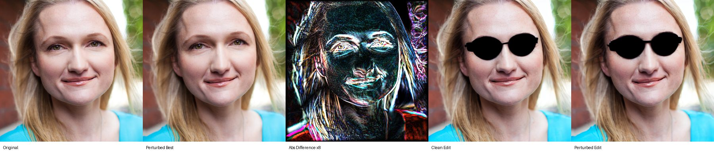

### face_005 / add headphones

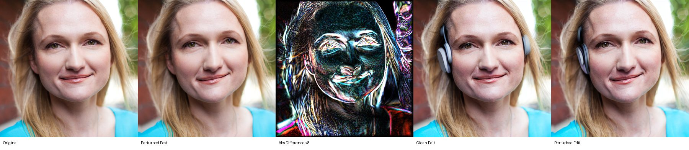

## Graphs

### Z vs iteration

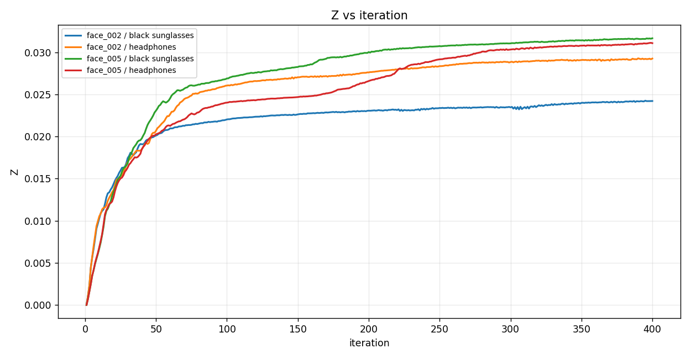

### Loss vs iteration

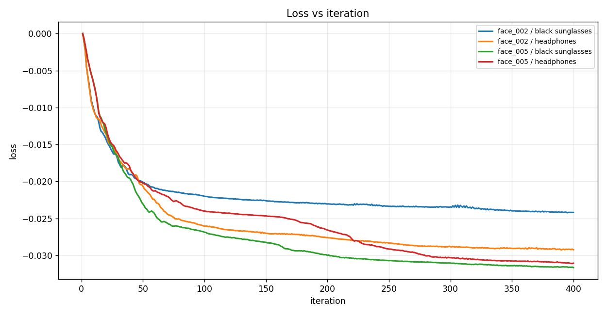

### ArcFace cosine similarity vs iteration

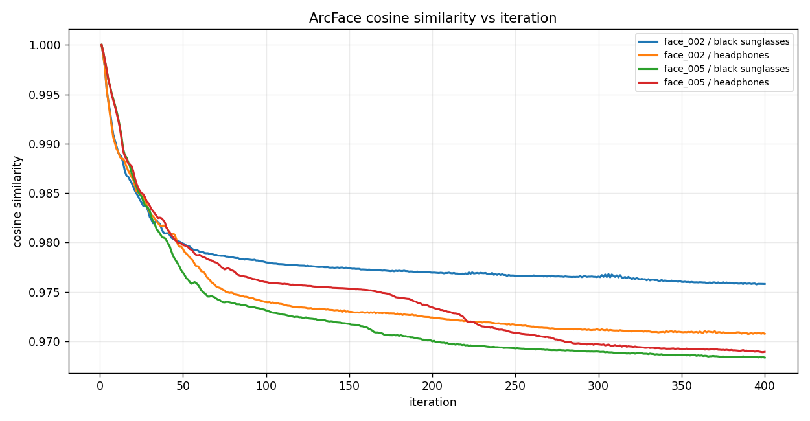

### ArcFace cosine distance vs iteration

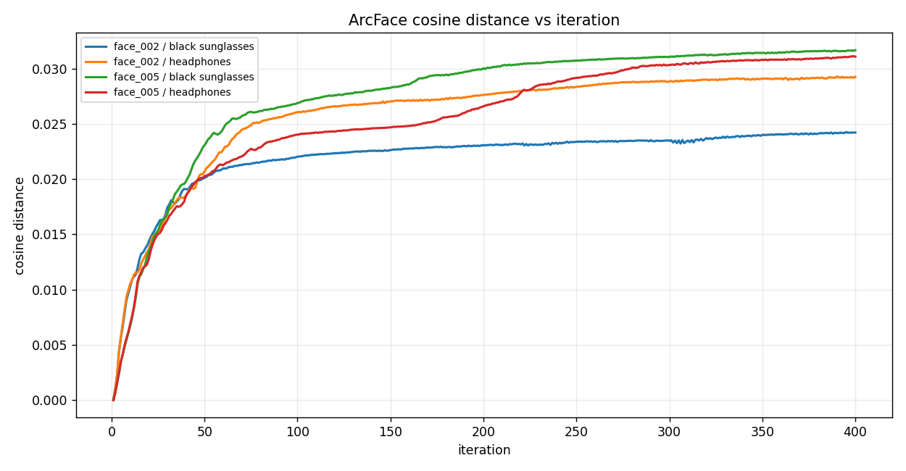

### Cosine identity similarity score (%) vs iteration

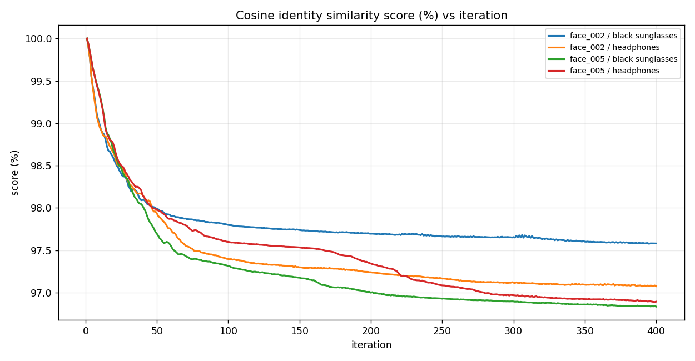

### PSNR to original vs iteration

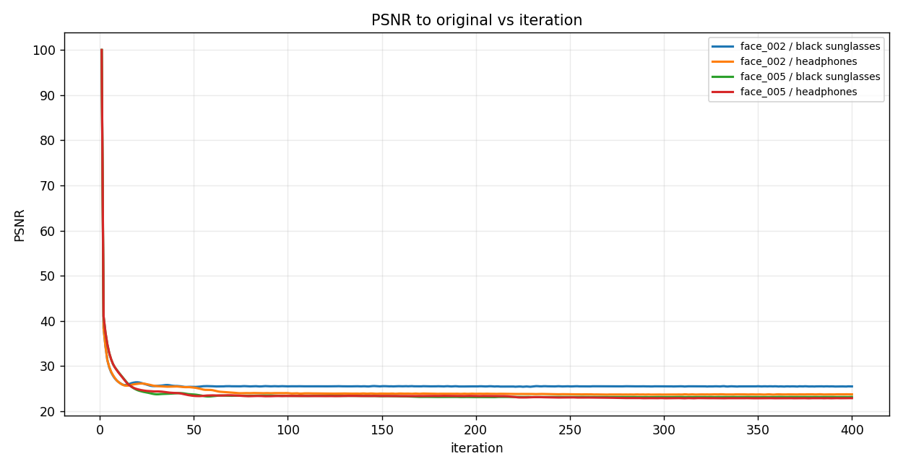

### SSIM to original vs iteration

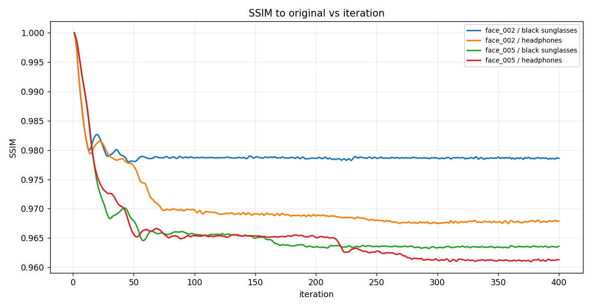

### Combined max displacement vs iteration

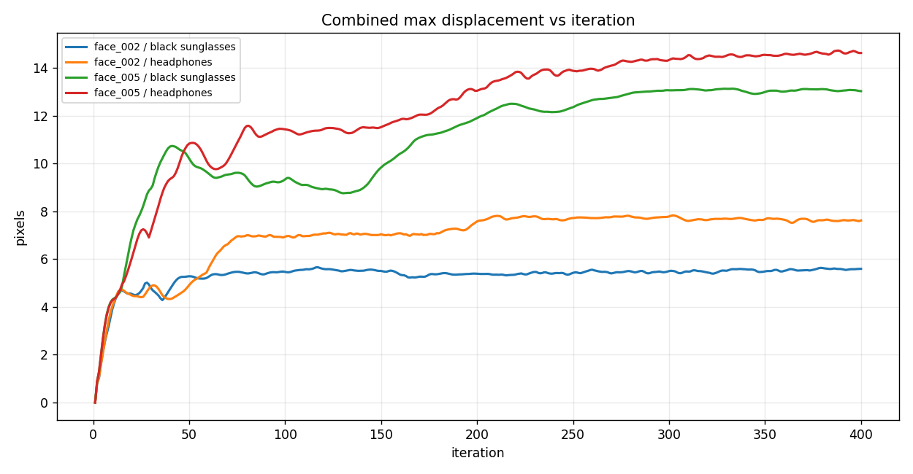

### Fraction clamped vs iteration

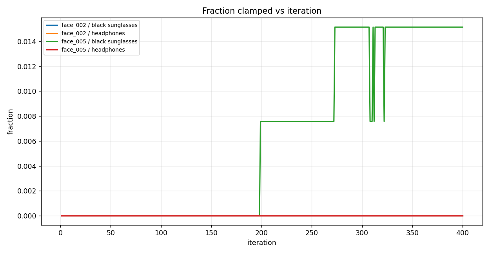

### Final Z vs final SSIM

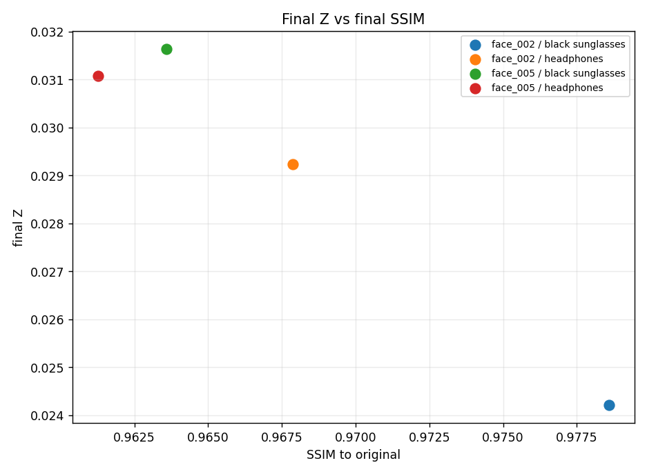

### Final Z vs final PSNR

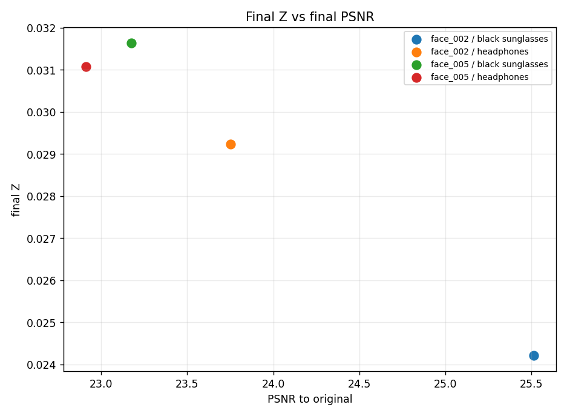

### Component max displacement

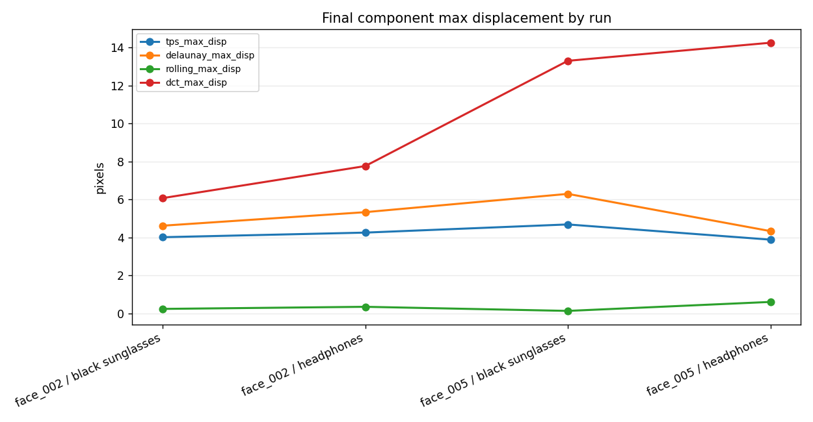
