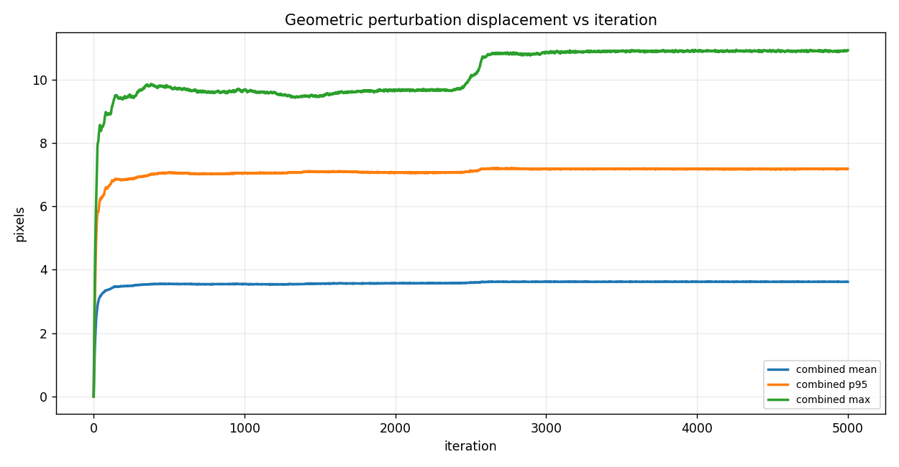
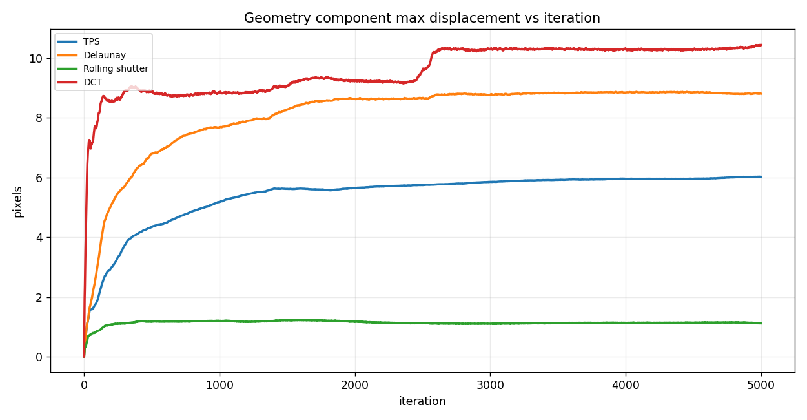

# FACE: ArcFace White-box Geometric Identity Optimization

Frozen iResNet-100 identity-distance results with downstream InstructPix2Pix evaluation

FACE optimizes `Z = 1 - cosine_similarity` with `loss = -Z` against frozen ArcFace iResNet-100.

## Image strips

### face_002 / add black sunglasses

### face_002 / add headphones

### face_005 / add black sunglasses

### face_005 / add headphones

## Graphs

### Z vs iteration

### Loss vs iteration

### PSNR to original vs iteration

### SSIM to original vs iteration

### Geometric perturbation displacement vs iteration

### Geometry component max displacement vs iteration

