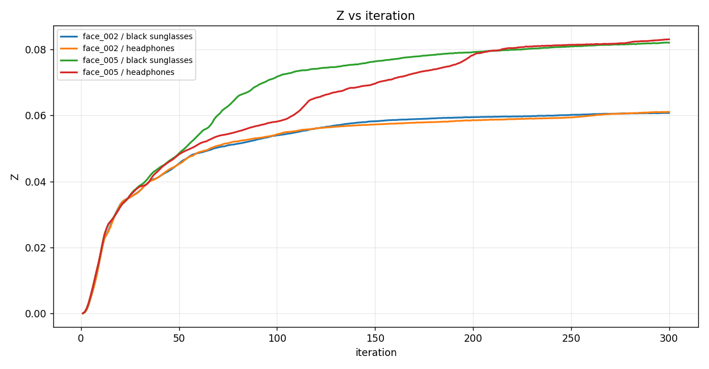
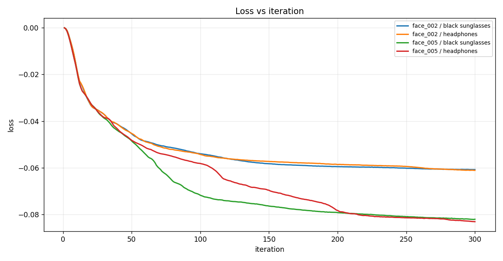
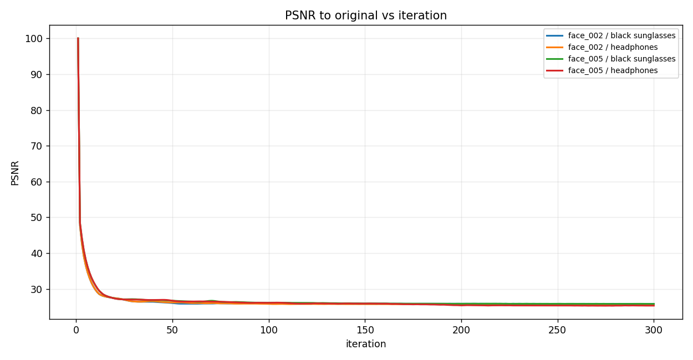
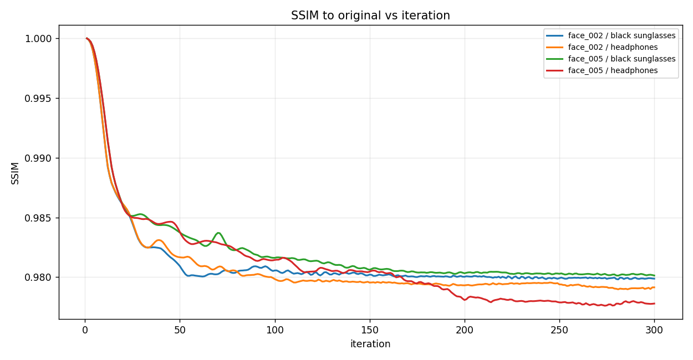
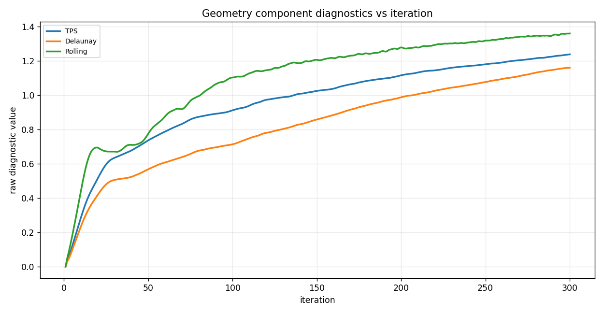
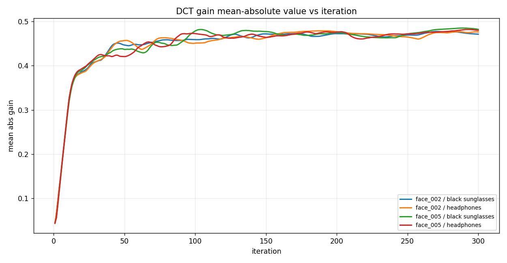
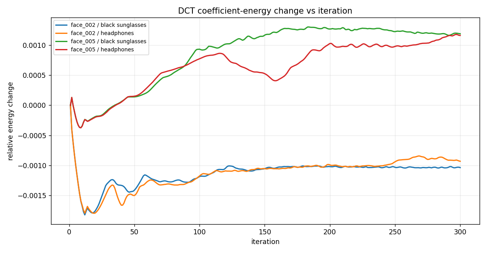
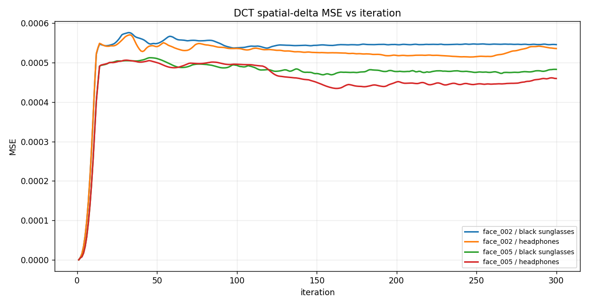
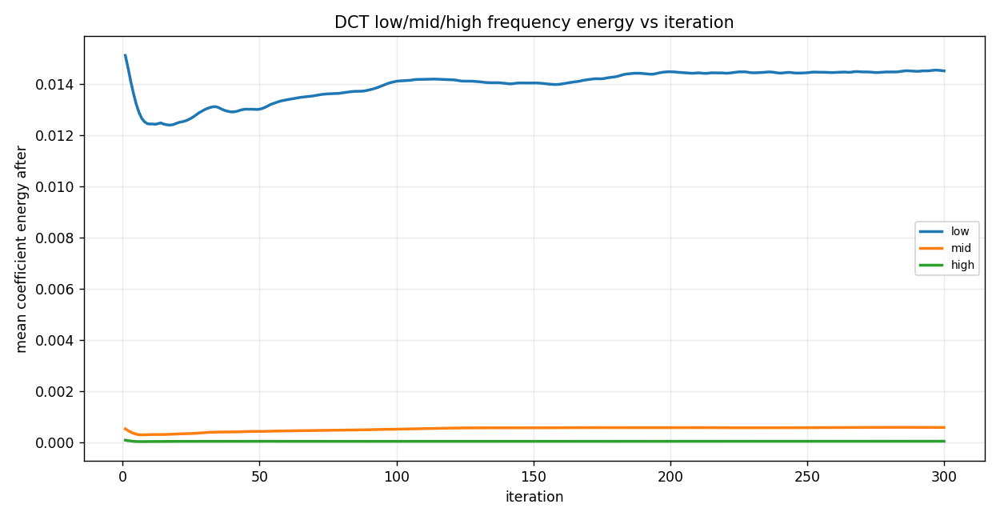
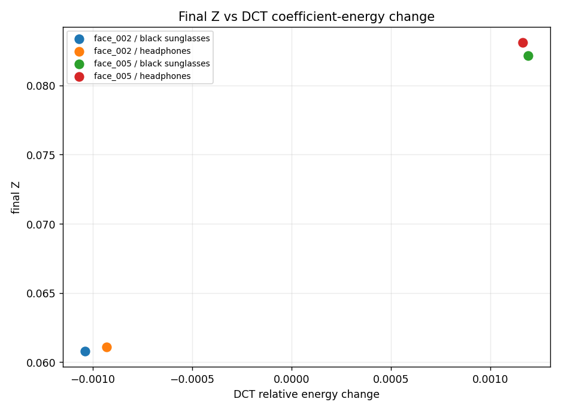

# FACE: ArcFace White-box Spatial + Frequency Identity Optimization

Frozen iResNet-100 identity-distance results with image-DCT perturbation and downstream InstructPix2Pix evaluation

FACE optimizes `Z = 1 - cosine_similarity` with `loss = -Z` against frozen ArcFace iResNet-100. DCT is reported as an image-frequency coefficient perturbation, not a spatial flow.

## Image strips

### face_002 / add black sunglasses

### face_002 / add headphones

### face_005 / add black sunglasses

### face_005 / add headphones

## Graphs

### Z vs iteration

### Loss vs iteration

### PSNR to original vs iteration

### SSIM to original vs iteration

### Geometry component diagnostics vs iteration

### DCT gain mean-absolute value vs iteration

### DCT coefficient-energy change vs iteration

### DCT spatial-delta MSE vs iteration

### DCT low/mid/high frequency energy vs iteration

### Final Z vs DCT coefficient-energy change

